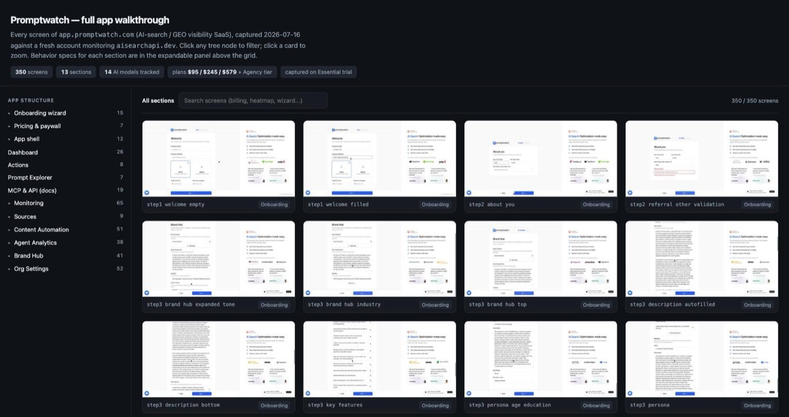
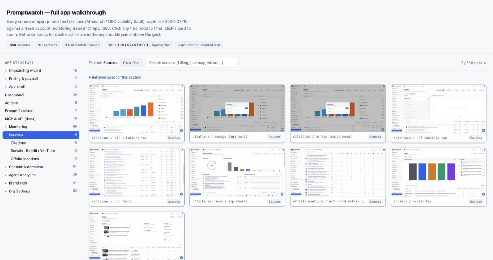
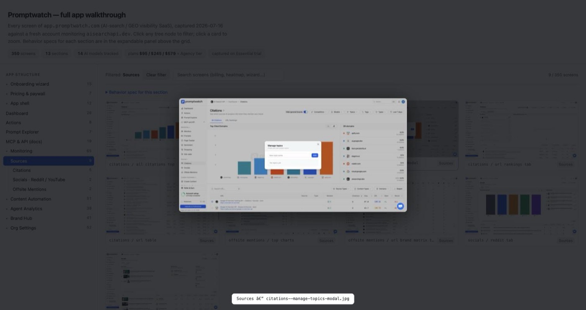

<div align="center">

# 🔭 AppAtlas

### Map every screen of any app — automatically.

**AppAtlas** is a [Claude Code](https://claude.com/claude-code) skill + plugin that walks an entire application end to end and produces a complete **atlas**: every screen, sub-tab, setting, and flow — captured as screenshots, flow recordings, and behavior specs, then assembled into a **Mobbin-style browsable index**.

Works on **web apps** (via the Claude-in-Chrome tools) and **iOS / Android apps** (via the Xcode simulator or Android emulator).

**[▶ Explore a live atlas](https://sleepyw33kday.github.io/appatlas/example/)** &nbsp;·&nbsp; [Landing page](https://sleepyw33kday.github.io/appatlas/) &nbsp;·&nbsp; [Install](#install) &nbsp;·&nbsp; [How it works](#how-it-works)

> The live atlas above is a real, explorable AppAtlas output: 350 screens of a production SaaS, with the collapsible app-structure tree, live filtering, search, and per-section behavior specs.



</div>

---

## Why

Documenting a product's full surface — for UX research, competitive teardowns, onboarding a team, or QA regression baselines — is slow, manual, and always goes stale. AppAtlas turns "spend two days clicking through and screenshotting everything" into one instruction. Claude orchestrates a fleet of subagents that crawl the app systematically, write down exactly what each control does, and hand you a single self-contained page you can filter, search, and share.

## What you get

- **A folder tree** — one directory per app section, each with a `spec.md` behavior spec and a `screenshots/` set.
- **Behavior specs** — every button, dropdown, filter, toggle, modal, empty state, and gated/upgrade screen, described in plain language.
- **Flow recordings** — short GIFs of the key product moments (a record drill-down, a generation completing).
- **A browsable atlas** — a single self-contained HTML page: a collapsible app-hierarchy tree (nav group → page → sub-tab → modal) that filters a searchable screenshot gallery, with each screen's spec one click away. Light + dark, no external dependencies.

<table>
<tr>
<td width="50%"><br><em>Collapsible app-structure tree filters the gallery by section, page, or sub-tab.</em></td>
<td width="50%"><br><em>Click any screen to zoom; behavior specs live in an expandable panel per section.</em></td>
</tr>
</table>

### A recorded flow, captured automatically


## How it works

AppAtlas encodes a battle-tested orchestration pattern, not just a prompt:

1. **Recon** — Claude signs in, walks onboarding capturing every step, maps the full navigation, and writes an agent briefing + folder skeleton.
2. **Crawl** — one Sonnet subagent per app section, **strictly sequential per UI resource** (a browser tab group or a simulator is a single shared surface — parallel agents fight over it). Each captures screenshots and writes its spec.
3. **Review → fix → coverage audit** — parallel QA agents verify every screenshot against its spec, then a feature-level audit classifies each control as *walked / shallow / skipped / missed* and fills the gaps (the ones that hide in avatar menus, nested dialogs, and org-vs-project route twins).
4. **Atlas** — a generator assembles the self-contained browsable index.

It ships with a **blocker playbook** for the things that derail an automated crawl: client-side paywall overlays, trial/checkout hand-off (it never enters payment data — it hands the checkout to you), quota budgeting, blank-shell/renderer recovery, and mid-crawl subagent deaths.

> Built and verified with a TDD-for-skills process on a real **13-section, 350-screenshot** teardown of a live SaaS.

## Install

### As a plugin (Claude Code marketplace)

```
/plugin marketplace add sleepyw33kday/appatlas
/plugin install appatlas@appatlas
```

### As a skill (manual)

```bash
git clone https://github.com/sleepyw33kday/appatlas
cp -r appatlas/skills/appatlas ~/.claude/skills/appatlas
```

## Use

Ask Claude Code for a walkthrough of any app:

> Do an appatlas of `https://app.example.com` — document every screen and setting, screenshots + specs, and give me a browsable index.

Or point it at a mobile build:

> AppAtlas our iOS app in the simulator — every tab, every setting, and a browsable atlas at the end.

## Requirements

- **Claude Code** with the **Claude-in-Chrome** browser tools (for web apps).
- For mobile: **Xcode + simulator** with `idb` (iOS), or **Android SDK + emulator** with `adb`.
- An account on the target app you're authorized to document. AppAtlas never enters payment credentials, never performs destructive or irreversible actions, and hands paid checkouts back to you.

## What's in this repo

```
appatlas/
├── .claude-plugin/
│   ├── plugin.json          # plugin manifest
│   └── marketplace.json     # marketplace manifest (this repo is its own marketplace)
├── skills/appatlas/
│   ├── SKILL.md             # the skill: phases, iron rules, blocker table, mobile lane
│   └── references/
│       └── playbook.md      # briefing template, capture workflow, index builder, coverage audit
├── assets/                  # listing screenshots + demo GIF
└── docs/                    # GitHub Pages landing page
```

## License

[MIT](LICENSE) © [sleepyw33kday](https://github.com/sleepyw33kday)
